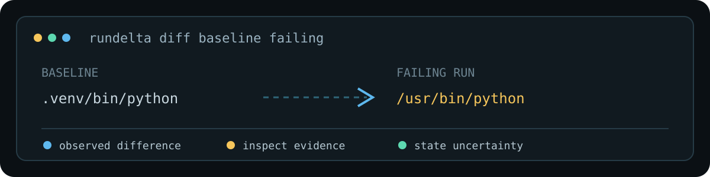

# RunDelta



> **See what changed between runs.**
> **看清两次运行之间发生了什么变化。**

[English](#english) · [中文](#中文) · [Project guide / 项目说明](docs/PROJECT.md) · [Build guide / 构建说明](docs/BUILDING.md)

---

## 中文

RunDelta 是一个实验性的 Linux 命令运行差异观测工具，使用 Rust 编写，并调用外部 `strace` 采集受支持的进程执行和文件访问事件。

它面向这样的问题：同一条命令昨天能运行、今天失败，而代码似乎没有变化。RunDelta 将两次真实运行记录进行比较，展示实际执行程序、文件访问结果、启动环境和进程行为中**已观察到的差异**，并保留原始证据的位置。

它提供排查线索，不把“发生变化”表述为“已经找到根因”。

### 工作流

```bash
rundelta record good -- python build.py
rundelta record bad -- python build.py
rundelta diff good bad
```

典型报告可帮助发现：

- 虚拟环境 Python 被系统 Python 替换；
- 某份配置文件新增、消失或访问结果从成功变为 `ENOENT`；
- 某个子进程、工具链或启动环境发生变化；
- 某次采集不完整，因此结果只能作为可浏览线索。

### 为什么可靠性状态很重要

RunDelta 不把数据不完整伪装成“无差异”。`diff` 的文本和 JSON 使用相同退出码：

| 退出码 | 含义 |
| ---: | --- |
| 0 | 两次采集完整、存储已验证，且没有观察到差异 |
| 1 | 两次采集完整、存储已验证，且观察到差异 |
| 2 | 工具错误、记录损坏或不支持；不提供普通比较结论 |
| 3 | 采集不完整、未知、未最终完成或存储未经验证；仍可浏览观察结果 |

### 安装与要求

当前 alpha 仅面向 Linux，要求 Rust/Cargo、可用的外部 `strace` 和追踪子进程所需权限。已测试环境是 x86_64 Linux、Rust/Cargo 1.98.1 和 strace 6.16；这不是最低版本或全部发行版兼容性承诺。

```bash
cargo build --release --locked
cargo install --path . --locked
rundelta --help
```

RunDelta 不捆绑 strace，也绝不会在 tracer 不可用时悄悄直接执行目标命令。若 strace 不在 `PATH`，可设置 `RUNDELTA_STRACE` 为其可执行文件路径。

### 数据与边界

运行记录可能保存命令参数、路径、原始 strace 证据和显式选定的环境变量。它们可能包含敏感信息；分享前请自行检查。默认数据目录为 `$XDG_DATA_HOME/rundelta`，否则为 `$HOME/.local/share/rundelta`。

当前不提供通用根因判断、自动修复、文件内容差异诊断、完整重放、网络内容采集或未记录运行的事后恢复。动态 CMake/Cargo 构建可能产生大量正常重复噪声；同一路径不代表同一内容，打开文件也不代表文件内容影响了结果。

CLI 和 JSON 字段保持英文，以保证脚本、日志检索和自动化接口稳定；仓库文档提供中英双语说明。

详见 [项目说明](docs/PROJECT.md) 与 [构建说明](docs/BUILDING.md)。

---

## English

RunDelta is an experimental Linux command-execution observation tool written in Rust. It uses an external `strace` executable to capture supported execution and file-access events, then compares two real runs and reports observed differences with evidence locations.

It is built for the familiar situation where a command worked yesterday, fails today, and the code appears unchanged. RunDelta can surface changes in the executable that actually ran, accessed files, process behavior, and explicitly recorded startup environment values.

Differences are investigation clues, not proof of a root cause.

### Workflow

```bash
rundelta record good -- python build.py
rundelta record bad -- python build.py
rundelta diff good bad
rundelta diff good bad --json
rundelta list
rundelta show good
```

For a useful comparison, preserve the command, argv and initial working directory while changing one explainable condition where possible. Different entry commands can confound the result. The target inherits stdin, stdout and stderr; arguments are passed separately, with no implicit shell expansion.

Use repeatable `--env NAME` options to record selected startup variables, for example:

```bash
rundelta record env-check --env PATH -- /usr/bin/true
```

An environment snapshot does not describe all later child environments.

### Exit codes and reliability

Text and JSON use the same `diff` semantics:

| Code | Meaning |
| ---: | --- |
| 0 | Both captures are complete for supported events, storage is verified, and no differences were observed |
| 1 | Both captures are complete for supported events, storage is verified, and differences were observed |
| 2 | Tool error, missing/unsupported record, or corrupt data; no ordinary comparison conclusion |
| 3 | Capture is incomplete/unknown or storage is unverified/unfinalized; observations remain browsable |

JSON keeps `observed_differences`, `reliability`, `exit_code`, and errors separate. A code-3 result is not a trustworthy comparison conclusion, even if it reports no observed differences.

`record` normally preserves the target exit code. A target signal returns `128 + signal`; collector failure returns 125; initialization and storage errors return 2. Those values can overlap with target exit codes, so inspect metadata and diagnostics.

### Requirements and installation

This alpha targets Linux and requires Rust/Cargo, a compatible external `strace`, and permission to trace child processes. The observed environment is x86_64 Linux, Rust/Cargo 1.98.1, and strace 6.16; it is not a minimum-version or distribution-support promise.

```bash
cargo build --release --locked
cargo install --path . --locked
rundelta --version
```

Install a trusted strace separately. It must support `--kill-on-exit`, `-f`, `-q`, `-I 2`, `-xx`, `-yy`, `-s`, and the supported syscall selection. RunDelta never falls back to executing a target without tracing. Set `RUNDELTA_STRACE` to an executable path when strace is outside PATH.

### Data, privacy, and removal

Records may contain argv, paths, raw strace evidence, and selected environment values. They may contain secrets and are stored/displayed without automatic redaction. Review them before sharing. The default data root is `$XDG_DATA_HOME/rundelta`, otherwise `$HOME/.local/share/rundelta`.

```bash
rundelta delete good
cargo uninstall RunDelta
```

`delete` permanently removes a run and its evidence. Uninstall removes the executable, not recorded data.

### Scope and limitations

Supported trace selection includes `execve`, `execveat`, `open`, `openat`, `openat2`, `access`, `faccessat`, `faccessat2`, `chdir`, `fchdir`, `clone`, `clone3`, `fork`, `vfork`, `unshare`, `setns`, `chroot`, `pivot_root`, process exits, and unfinished/resumed evidence. This is not support for all Linux process or namespace behavior.

Absolute paths come from syscall arguments or decodable strace path/fd annotations. A last observed CWD is context, not proof of a current physical path. Relative access without sufficient evidence stays uncertain. Proven `CLONE_FS` sharing is modeled per filesystem context; unknown flags or transitions remain incomplete.

RunDelta does not provide general root-cause determination, automatic repair, file-content diffing, complete replay, network-content capture, or retrospective recovery of unrecorded runs. Dynamic CMake/Cargo builds can generate substantial normal-repeat noise. Same paths do not prove same contents, and opening a file does not prove its contents affected execution.

The CLI and JSON schema remain English for stable automation; this repository documentation is bilingual.

See the [project guide](docs/PROJECT.md) and [building guide](docs/BUILDING.md) for architecture, validation, and binary-path limits.

## License

RunDelta is licensed under the MIT License; see [LICENSE](LICENSE).
Copyright (c) 2026 The RunDelta contributors.
